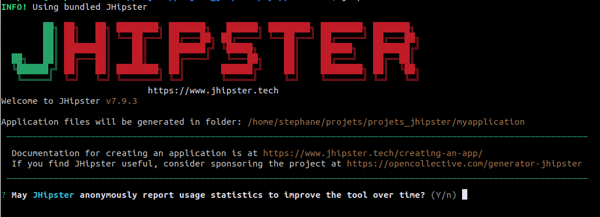

# JHipster on Ubuntu 22.04

# Resources
[ JHipster web site ](https://www.jhipster.tech/)  
[ JHipster Release notes ](https://www.jhipster.tech/releases/)  

# Versions used
- Ubuntu 22.04
- JHipster v7.9.3


# Installation
source : [ Installing JHipster ](https://www.jhipster.tech/installation/)  

**check nvm version**  
```
nvm version
```
*result:*  
v18.12.1  

**install last npm LTS version**  
```
nvm install --lts  
```
*result:*  
Installing latest LTS version.  
Downloading and installing node v18.12.1...  

**check npm version**  
```
npm version  
```
*result:*  
{  
  npm: '8.19.2',  
  node: '18.12.1',  
  v8: '10.2.154.15-node.12',  
... (truncated)  

**check for vulnerabily**
```
npm audit
```
*result:*  
found 0 vulnerabilities


**check java version** ( minimum version 11 )
```
java --version  
```
*result:*  
openjdk 11.0.17 2022-10-18  
OpenJDK Runtime Environment (build 11.0.17+8-post-Ubuntu-1ubuntu222.04)  
OpenJDK 64-Bit Server VM (build 11.0.17+8-post-Ubuntu-1ubuntu222.04, mixed mode, sharing)  


## Running first time with error :(
```
jhipster  
```
get error : Error [ERR_PACKAGE_PATH_NOT_EXPORTED]: Package subpath **'./lib/util/namespace' is not defined by "exports" in /opt/homebrew/lib/node_modules/generator-jhipster/node_modules/yeoman-environment/package.json**  

correcting this bug in current version  ( see [ Github Running jhipster command throws Error ](https://github.com/jhipster/generator-jhipster/issues/19627)  )  

```
cd ~/.nvm/versions/node/v18.12.1/lib/node_modules/generator-jhipster/node_modules/yeoman-environment  
```
- backup the file  
```
cp package.json package.json.backup_today  
```
- Correct file with your favorite editor  
```
vi package.json  
```
- add the bold line below :   
*"exports": {*  
*".": "./lib/environment.js",*  
*"./cli/": "./cli/",*  
*"./lib/": "./lib/",*  
*"./lib/util/": "./lib/util/",*  
*"./adapter": "./lib/adapter.js",*  
*"./conflicter": "./lib/util/conflicter.js",*  
*"./log": "./lib/util/log.js",*  
*"./transform": "./lib/util/transform.js",*  
*"./package.json": "./package.json"*  
**", ./lib/util/namespace": "./lib/util/namespace.js"**  

## Play the game now !
```
jhipster --version  
```
*result:*  
*INFO! Using bundled JHipster*  
*7.9.3*  

Need a bit help ?
```
hipster --help  
```

## Start creating your application

source : [ Creating an application ](https://www.jhipster.tech/creating-an-app/)  
- Create an empty directory in which you will create your application :  

```
mkdir myapplication  
```

- Go to that directory:  

```
cd myapplication/  
```

- To generate your application, type:  

```
jhipster  
```

- and answer questions asked by the generator !  

 


  

Enjoy !! :sunglasses: :tropical_drink: :tropical_drink:
